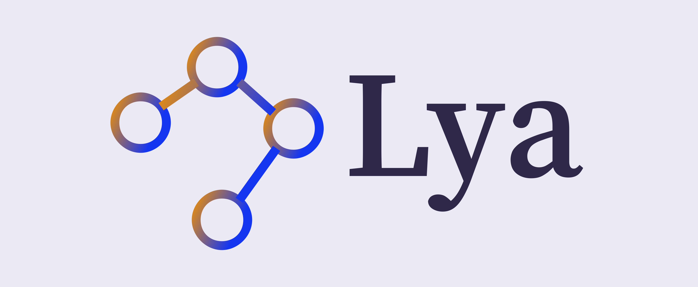

[](https://www.npmjs.com/package/@andromeda/lya)

Module-aware Fracture and Recombination for Dynamic Analysis

## What's Lya?

Lya is a coarse-grained dynamic analysis framework. At runtime, it fractures the
application  at  the  boundaries  of libraries,  transforms  their  context  and
interfaces  to insert  interposition  wrappers, and  recombines  them back  into
the  original structure.  Interposition  wrappers have  full  visibility at  any
interaction  that  crosses  a  boundary---including  global  variables,  runtime
primitives, access to the process's  environment, etc. This enables powerful but
inexpensive analyses that  answer questions about the  security, performance, or
general behavior of the program.

Programmers  interested  in  Lya  fall   under  two  categories.  The  first  is
programmers who want to  use one of the available analyses  to gain insight into
their  application.  These  can  install  and configure  Lya  with  an  existing
analysis---for more information see [how to use lya](how-to-use-Lya) below.

The second  is programmers who want  to write their own  analyses, achievable by
providing a few methods and parameters; in our experience, powerful analyses can
be expressed in only  a few lines of code---for more info, see  [how to write an
analysis](how-to-write-an-analysis) below.

## Installation

Lya runs with __Node v8.9.4__. You can use [nvm (macOS/Linux)](https://github.com/nvm-sh/nvm#installation) 
to switch Node versions between different projects.

### Option 1: Npm
```Shell
npm i @andromeda/lya --save-dev
```

If you want to install globally, so as to analyzing any program or library in the system, replace `--save-dev` with `-g`.

### Option 2: From source
```Shell 
git clone https://github.com/andromeda/lya/
cd lya
npm install
```

### Option 3: From docker image
```Shell
docker pull xxxxx
docker start -i "name of xxxxx"
```

## How to Use Lya?

Then, add lya _as  a first import at the top-level  file_ in your project---that
is,  almost always  Lya  has to  be  the first  package to  be  loaded. One  can
configure  several parameters,  including  use  any of  the  predefined list  of
analyses. For example:

```JavaScript
let lya = require("@andromeda/lya");
let conf = {
  analysis: lya.preset.ON_OFF,
  saveResults: require("path").join(__dirname, "dynamic.json"),
};
lya.configRequire(require, conf);
require("./main.js");
```

The configuration above first configures running the `ON_OFF` analysis, and saves the results in `./dynamic.json`. 
For more configuration options and details, see the [configuration docs]().

## How to Create a New  Analysis?

Lya expects the  developer of a new  analysis to provide a few  methods that Lya
will hook  across all modules. It  supports five methods, but  a useful analysis
can be written with any subset of them.

Lya provides the following hooks:

* `sourceTransform(src)`: Apply a source transformation to the loaded library. Example analyses: [uncomment](./src/uncomment.js).
  * `src`: String representation of the library
  * Expected `return`: a script representation of the library

* `onImport(caller, callee, name)`: Each time we load a library this hook is called. Usefull for dependency graphs. Analysis example: [print-require](./src/print-require.js)
  * `caller`: the path of the module that loads the module
  * `calle`: the path of the loaded library
  * `name`: the name of the library

* `onRead(target, name, ...)`: Each time we read a value from an imported module this function is called. Example Analysis:  [read-write-execute](./src/rwx.js)
  * `target`: The target object on which we get the property.
  * `name`: The name of the property
  * `nameToStore`: The recommended name to use by _Lya_.
  * `currentModule`: The name of the module that calls the function
  * `typeClass`: Indicates which category the analysis belongs to (_user-global, es-globals, node-globals etc_)

* `onCallPre(target, thisArg, ...)`: Before the execution of a function this hook is called. Example analysis: [profiling-relative](./src/profiling-relative.js)
  * `target`: The target function to call.
  * `thisArg`: The value of _this_ provided for the call to _target_.
  * `argumentsList`: An _array-like_ object specifying the arguments with which _target_ will be called.
  * `name`: The name of the function
  * `nameToStore`: Recommended name to use for storing the result of the analysis
  * `currentModule`: The name of the module that calls the function
  * `declareModule`: The name of the module where we declared the target function
  * `typeClass`: Indicates which category the analysis belongs to (_user-global, es-globals, node-globals etc_)

* `onCallPost(target, thisArg, ...)`: After the execution of a function this hooked is called. Extremly usefull for type analysis or time analysis. Example Analysis: [simple-types](./src/simple-types.js)
  * `target`: The target function to call.
  * `thisArg`: The value of _this_ provided for the call to _target_.
  * `argumentsList`: An _array-like_ object specifying the arguments with which _target_ will be called.
  * `name`: The name of the function
  * `nameToStore`: Recommended name to use for storing the result of the analysis
  * `currentModule`: The name of the module that calls the function
  * `declareModule`: The name of the module where we declared the target function
  * `typeClass`: Indicates which category the analysis belongs to (_user-global, es-globals, node-globals etc_)
  * `result`: It contains the result of the _target function_ execution.

* `onWrite(target, name, value, ...)`: This hook is called is called before we set a property on a object. Example Analysis: [read-write-execute](./src/rwx.js)
  * `target`: The target object on which to set the property
  * `name`: The name of the property to set
  * `value`: The value to set
  * `declareModule`: The name of the module where we declared the target function
  * `parentName`: The name of the parent object
  * `nameToStore`: Recommended name to use for storing the result of the analysis

* `onConstruct(target, args, currentName, nameToStore)`: We call this hook before the execution of a constructor.
  * `target`: The target function to call
  * `args`: An array-like object specifying the arguments with which target should be called
  * `currentName`: The name of the module where the constructor is called
  * `nameToStore`: Recommended name to use for storing the result of the analysis
  
* `onHas(target, prop, currentName, nameToStore)`: This method is called before you check if a property is in an object. 
  * `target`: The target object in which to look for the property
  * `prop`: The property we look for
  * `currentName`: The name of the module where the constructor is called
  * `nameToStore`: Recommended name to use for storing the result of the analysis

* `onExit(data)`: Last call before program exit -- commonly used for flushing results. Example analyses: [coarse-types](./src/coarse-types.js).
  * `data`: 
  * Expected `return`: None.
  
Lya provides the following utility function:

```JavaScript
const getObjectInfo = (obj) => {
      name: objName,
      path: objPath,
}
```
